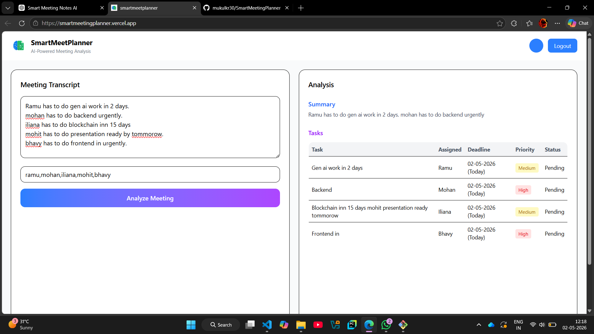

# SmartMeetingPlanner

Smart Meeting Notes & Action Tracker

An Agentic AI-powered web application that transforms meeting transcripts into structured summaries, actionable tasks, deadlines, and assignments — automatically.

🧠 Project Overview

Smart Meeting Planner leverages AI + Full Stack Architecture to:

Convert raw meeting text into meaningful insights
Automatically extract tasks and assign them to team members
Estimate deadlines and priorities
Provide a clean dashboard for tracking progress
🎯 Key Features

✅ AI-generated meeting summary
✅ Automatic task extraction
✅ Smart task assignment to team members
✅ Deadline & priority estimation
✅ Clean dashboard UI
✅ JWT-based authentication
✅ Scalable microservice architecture

🔁 Workflow
User logs in (JWT authentication)
User submits meeting transcript
Request flows:
React → Spring Boot
Spring Boot → FastAPI
FastAPI:
Generates summary
Extracts tasks
Assigns members + deadlines
Response flows back to frontend
Results displayed in dashboard

🛠️ Tech Stack
Frontend
⚛️ React
🎨 Tailwind CSS
Backend
☕ Spring Boot
🔐 JWT Authentication
AI Service
🐍 FastAPI
🤖 LLM / NLP-based processing
Database (Optional)
🗄️ PostgreSQL / H2
📦 API Design

Request
{
  "transcript": "Meeting discussion text...",
  "team_members": ["Rahul", "Ankit", "Priya"]
}

Response
{
  "summary": "Meeting discussed project updates and task allocation.",
  "tasks": [
    {
      "task": "Prepare project report",
      "assigned_to": "Rahul",
      "deadline": "05-05-2026",
      "priority": "High",
      "status": "Pending"
    }
  ]
}

cd ai-service
pip install -r requirements.txt
uvicorn main:app --reload

Runs on: http://localhost:8000

3️⃣ Start Spring Boot Backend
cd backend
mvn spring-boot:run

Runs on: http://localhost:8080

4️⃣ Start React Frontend
cd frontend
npm install
npm start

Runs on: https://smartmeetingplanner.vercel.app/
